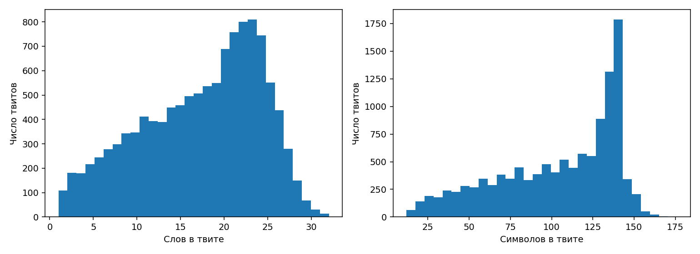
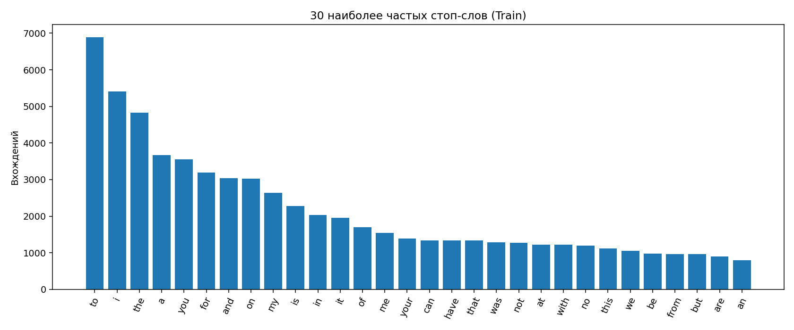

# Отчёт: Twitter US Airline Sentiment

## Выборка и структура

После удаления пустых значений: 14640. Train: 11712, Test: 2928; разбиение 80/20, стратификация по `airline_sentiment`, seed=42.

| Класс | Train | Test |
|---|---:|---:|
| negative | 7343 | 1835 |
| neutral | 2479 | 620 |
| positive | 1890 | 473 |

Средняя длина Train: 17.32 слов и 103.92 символов; длины измерены до очистки.

## Шум и очистка

Число документов Train с соответствующим видом шума (виды пересекаются):

| Вид | Документов |
|---|---:|
| URL | 929 |
| упоминания | 11712 |
| хештеги | 1905 |
| HTML-сущности | 583 |
| эмодзи | 379 |
| числа | 3360 |

URL, почта, упоминания, хештеги, числа и эмодзи заменяются отдельными токенами. HTML-сущности декодируются; пунктуация `.!?,;:` сохраняется. Остальные символы отсекаются при токенизации. Границы `<s>` и `</s>` добавляются после очистки. Хештеги заменяются целиком: это уменьшает словарь, но теряет смысл их текста.

## Нормализация

Сравнение словарей только по буквенным токенам Train, без пунктуации и специальных меток. Лемматизация WordNet учитывает часть речи, оценённую NLTK; ошибки разметки влияют на результат.

| Исходный | После стемминга Porter | После лемматизации WordNet |
|---:|---:|---:|
| 8808 | 6480 | 7091 |

Стемминг сильнее объединяет формы, но может получать несловарные основы; лемматизация удобнее для чтения. Для биграммной модели ниже остаются очищенные исходные формы, чтобы не разрушать поверхностную грамматику.

## Пары похожих слов

Кандидаты: редкое слово (частота ≤2) и частое (≥5), расстояние 1 или 2. Это кандидаты на опечатки, а не доказанные ошибки; среди них бывают разные слова.

| Расстояние | Редкое слово | Частое слово | Частоты |
|---:|---|---|---:|
| 1 | flightn | flight | 1 / 3136 |
| 1 | fligt | flight | 1 / 3136 |
| 1 | fllight | flight | 1 / 3136 |
| 1 | slight | flight | 1 / 3136 |
| 1 | sour | your | 1 / 1390 |
| 1 | yout | your | 1 / 1390 |
| 1 | cave | have | 1 / 1342 |
| 1 | fave | have | 2 / 1342 |
| 1 | wave | have | 2 / 1342 |
| 1 | wiyh | with | 1 / 1215 |

## Биграммная модель

Размер словаря предсказываемых токенов: 5027. Слова с частотой <2 в Train заменены на `[UNK]` при обучении; невиданные слова Test тоже отображаются в `[UNK]`. `<s>` служит только контекстом, `</s>` предсказывается.

Без сглаживания: P(w|c)=count(c,w)/count(c); при неизвестном переходе вероятность нулевая. Со сглаживанием Лапласа: P(w|c)=(count(c,w)+1)/(count(c)+|V|). Перплексия: exp(-Σ log P(wᵢ|wᵢ₋₁)/M), M включает конечный токен каждого тестового документа.

| Режим | Перплексия Test |
|---|---:|
| Без сглаживания | ∞ |
| Лаплас (+1) | 422.93 |

Если встретился хотя бы один отсутствующий в Train переход, правдоподобие всей тестовой выборки без сглаживания равно нулю, поэтому перплексия бесконечна. Сглаживание назначает положительную вероятность каждому токену словаря; численное сравнение с ∞ не означает, что модель стала качественной по смыслу.

## Генерация (seed=42…46)

1. `<s> [USER] not the flight attendant at several times . thanks . any way to dm ? </s>`
2. `<s> [USER] only to talk to </s>`
3. `<s> [USER] [TAG] flightr and delay ? </s>`
4. `<s> [USER] in the [UNK] to check in the last minute delay this is charging for the u this is it wants fucking service rep wouldn't stow not cool !!! </s>`
5. `<s> [USER] also add it is very bad these prices thru security logic ? </s>`

Биграммы воспроизводят соседние сочетания, но не удерживают синтаксис и тему на длине всего твита; `[UNK]` и заменители шума снижают читаемость. Остановка происходит на `</s>` или после 30 сгенерированных токенов.
